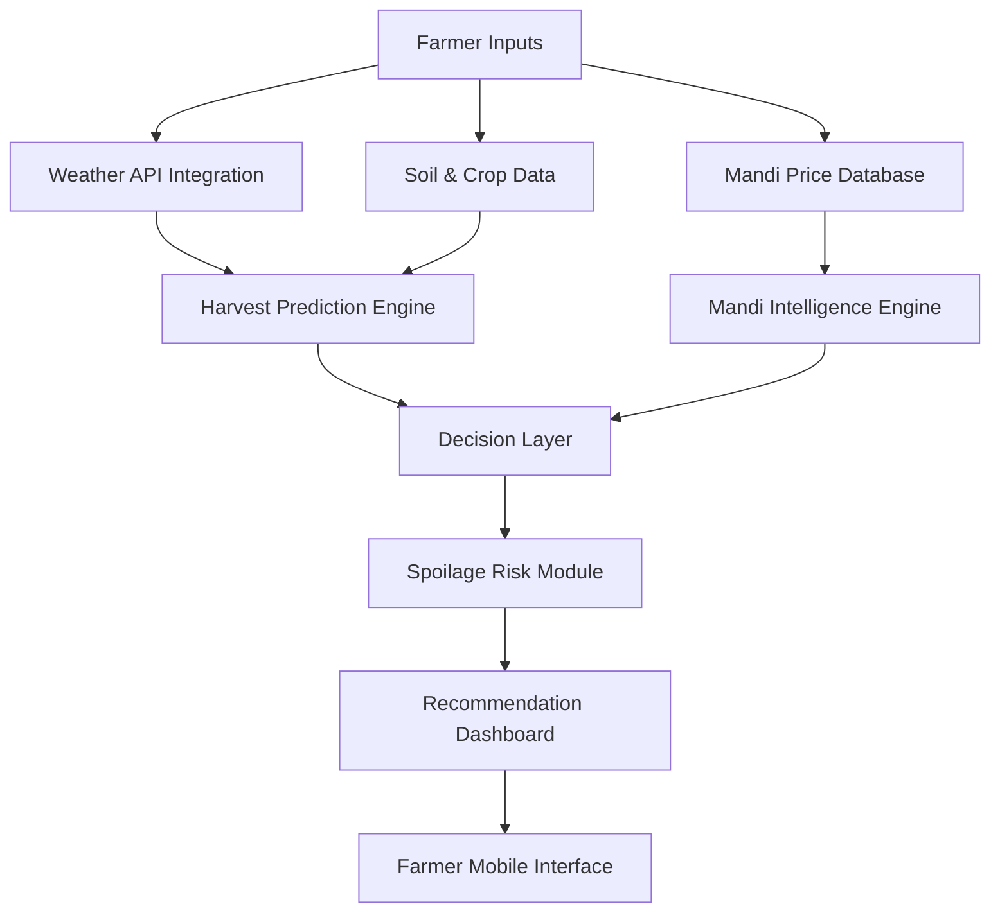

# 🌾 Untitled — AI-Driven Farm-to-Market Intelligence Platform

This repository contains the code bundle for **Untitled**, an AI-powered agricultural decision intelligence platform.

Original Figma Design:  
https://www.figma.com/design/wxjOLVYyMW0ldI5qutbRBt/Untitled

---

## 🚀 Running the Project

```bash
npm install
npm run dev
```

---

# 🚨 Problem Statement

India is one of the world’s largest agricultural producers. Yet **30–40% of agricultural output is lost post-harvest** — not due to poor farming practices, but due to weak decision intelligence between harvest and market realization.

The constraint is not production capacity.  
The constraint is **profit optimization.**

---

# 🔍 Core Structural Gaps

Farmers currently face:

- Harvest timing decisions without predictive weather intelligence  
- Mandi selection based on informal networks instead of data  
- No visibility into price volatility or mandi arrival volumes  
- No transport-adjusted net profit calculation  
- High spoilage risk due to storage and transit uncertainty  
- Limited transparency behind advisory recommendations  

This creates systemic **information asymmetry**:

| Stakeholder | Intelligence Access |
|-------------|--------------------|
| Traders     | Supply inflows     |
| Corporates  | Demand forecasting |
| Markets     | Dynamic pricing    |
| Farmers     | Reactive decisions |

---

# ⚠️ Fragmented Ecosystem

Existing solutions are disconnected:

- Weather apps provide forecasts — not harvest strategy  
- Price portals show mandi rates — not profitability insights  
- Advisory tools lack explainability  
- No unified system integrates farm conditions with real-time market economics  

---

# 📉 Economic Impact

Due to this intelligence gap, farmers often:

- Harvest too early or too late  
- Sell in oversupplied mandis  
- Incur unnecessary logistics costs  
- Experience preventable spoilage losses  

This results in:

- Reduced net income  
- Higher financial volatility  
- Lower bargaining power  
- Long-term economic stress  

---

# 🌍 Sustainability Disconnect

Sustainability practices such as:

- Soil health improvement  
- Residue management  
- Regenerative farming  

remain disconnected from profitability intelligence systems, limiting:

- Long-term productivity  
- Access to carbon-linked incentive programs  
- Climate-resilient agricultural planning  

---

# 🎯 Solution Vision

Build a **transparent, AI-driven farm-to-market intelligence platform** that:

- Optimizes harvest timing  
- Predicts mandi profitability  
- Adjusts for transport cost and spoilage risk  
- Provides explainable recommendations  
- Aligns sustainability with economic outcomes  

---

# 🏗️ System Architecture


